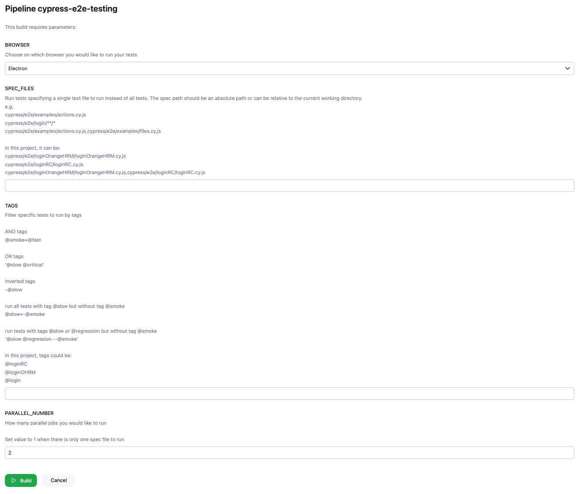
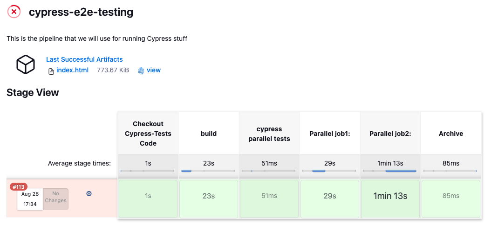
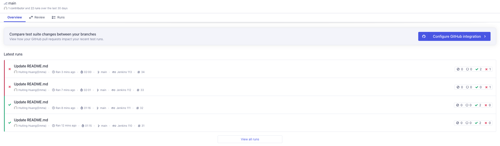

# Jenkinsfile

The Jenkinsfile to run E2E tests from [cypress-demo](https://github.com/HuitingHuang/cypress-demo.git)

The Jenkins pipeline can be parameterized to decide:
 - on which browser to run tests
 - which spec files to run filtered by file path
 - which test suites to run filtered by tags
 - how many parallel jobs running at the mean time

This job is parameterized like the following:
 

 
 
The job build view is like the following:
 

 
 
The Cypress dashboard received the test results from the Jenkins pipeline and shows like the following:
 

